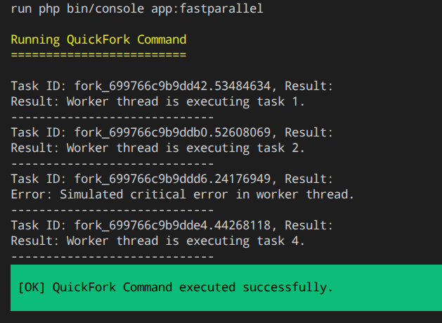
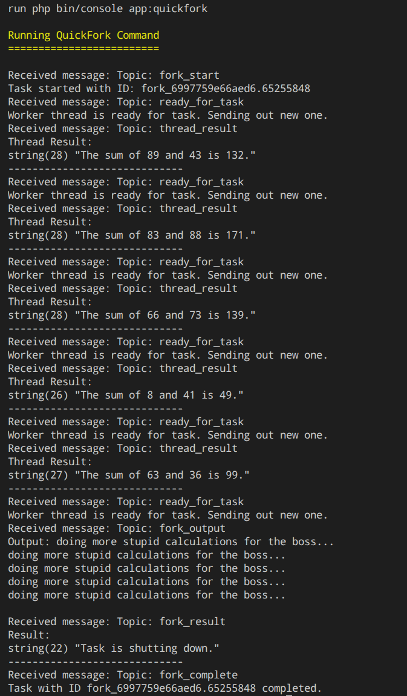

# Quickfork

This is a lightweight wrapper for PCNTL that adds Inter Process Communication (IPC) via Unix Sockets and a simple API for running tasks in parallel.
It is designed to be easy to use and to integrate into existing projects.

## Features
- Run tasks in parallel using a fixed pool of worker processes.
- IPC via Unix Sockets for communication between the main process and worker processes.
- Simple API for defining tasks and handling results.
- Error handling and timeouts for worker processes.
- Tasks are queued and executed as soon as a worker process is available, allowing for efficient resource management.

## Installation

You can install Quickfork via Composer.

First you need to add the repository to your composer.json:

```json
{
	"repositories": [
		{
			"type": "vcs",
			"url": "https://github.com/tbessenreither/quickfork"
		}
	]
}
```

Then you can require the package:

```bash
# For the latest stable version
composer require tbessenreither/quickfork
```

```bash
# For the latest version but might be unstable
composer require tbessenreither/quickfork:dev-main
```

## Usage

### Threadded Tasks with worker pool

The main use case of Quickfork is to run Tasks in parallel with a fixed pool of worker processes.

This example command will create 4 tasks that will be run on a maximum of 5 worker threads. Each task will execute the `workerThread` method, which simulates some work and returns a string. One of the tasks will throw an exception to demonstrate error handling.

If there are more threads than tasks only one thread per task will be created, so in this example only 4 threads will be created.
If you have more tasks than threads, the tasks will be queued and executed as soon as a thread is available.

```php

use Tbessenreither\Quickfork\Objects\Task;
use Tbessenreither\Quickfork\Quickfork;

class FastparallelCommand
{

    protected function execute(): int
    {
        $io = new SymfonyStyle($input, $output);

        $io->title('Running QuickFork Command');

        $quickfork = new Quickfork();

        try {
            $tasks = [];
            for ($i = 0; $i < 4; $i++) {
                $task = new Task(
                    callable: $this->workerThread(...),
                    arguments: [
                        'number' => $i + 1,
                        'index' => $i,
                    ],
                );
                $tasks[] = $task;
            }

            $results = $quickfork->runTasksInThreads($tasks, maxConcurrent: 5);

            foreach ($tasks as $task) {
                $taskId = $task->getId();
                $taskResult = $results[$taskId] ?? null;
                echo "Task ID: {$taskId}, Result:\n";
                if ($taskResult->hasError()) {
                    echo "Error: " . $taskResult->getError()->getMessage() . "\n";
                } else {
                    echo "Result: " . $taskResult->getResult() . "\n";
                }
                echo "-----------------------------\n";
            }

            $io->success('QuickFork Command executed successfully.');
        } catch (Throwable $e) {
            $io->error('An error occurred while executing QuickFork Command: ' . $e->getMessage());

            return Command::FAILURE;
        }


        return Command::SUCCESS;
    }

    private function workerThread(Task $task, ?int $index = null, ?int $number = null): string
    {
        //sleep(rand(1, 3));
        if ($number === 3) {
            throw new RuntimeException('Simulated critical error in worker thread.');
        }
        return "Worker thread is executing task {$number}.";
    }

}
```

This will print something like this:




### Running a Task with bidirectional IPC

This is a more niche use case, but it shows how to setup and use the IPC feature of Quickfork.
We create a single task that will run the `taskHandler` method. Then the following steps will happen:

1. The Quickfork process will trigger the `fork_start` message, which will be printed out by the parent process.
2. The `taskHandler` will send a message with the topic `ready_for_task` to the parent process.
3. The `parent process` will receive the `ready_for_task` message and send a new message with the topic `new_task` and some random numbers to sum up.
4. The `taskHandler` will receive the message, calculate the sum and then
    - send a message with the topic `thread_result` back to the parent process.
    - The `taskHandler` will then send another message with the topic `ready_for_task` to indicate that it is ready for another task.
5. The `parent process` will receive the result and print it out.
6. The steps 3-5 will repeat until the parent process has sent out 5 tasks, then it will send a message with the topic `shutdown` to the worker thread.
7. The `taskHandler` will receive the `shutdown` message and exit the loop.
    - This will cause Quickfork to trigger the `fork_output`, `fork_result` and `fork_complete` messages, which will be printed out by the parent process.


```php
class QuickforkCommand extends Command
{
    private int $numberOfTasks = 5;

    protected function execute(InputInterface $input, OutputInterface $output): int
    {
        $io = new SymfonyStyle($input, $output);

        $io->title('Running QuickFork Command');

        $quickfork = new Quickfork();

        $task = new Task(
            callable: $this->taskHandler(...),
            arguments: [],
        );
        $quickfork->runTask($task);

        while ($task->isRunning()) {
            $messages = $task->getSocket()->getMessages();
            $this->handleParentMessages($messages, $task->getSocket());
            usleep(100 * 1000); // Sleep for 100ms to prevent busy waiting
        }

        $finalMessages = $task->getSocket()->getMessages();
        $this->handleParentMessages($finalMessages, $task->getSocket());

        return Command::SUCCESS;
    }

    /**
     * @param Message[] $messages
     */
    private function handleParentMessages(array $messages, Socket $socket): void
    {
        foreach ($messages as $message) {
            echo "Received message: Topic: {$message->getTopic()}\n";

            if ($message->getTopic() === 'fork_start') {
                echo "Task started with ID: {$message->getForkId()}\n";
            } elseif ($message->getTopic() === 'fork_complete') {
                echo "Task with ID {$message->getForkId()} completed.\n";
            } elseif ($message->getTopic() === 'fork_output') {
                echo "Output: {$message->getContent()}\n";
            } elseif ($message->getTopic() === 'fork_result') {
                echo "Result:\n";
                var_dump($message->getContent());
                echo "-----------------------------\n";
            } elseif ($message->getTopic() === 'fork_error') {
                echo "Error:\n";
                var_dump($message->getContent());
                echo "-----------------------------\n";
            } elseif ($message->getTopic() === 'ready_for_task') {
                echo "Worker thread is ready for task. Sending out new one.\n";
                if ($this->numberOfTasks > 0) {
                    $socket->send(new Message(
                        topic: 'new_task',
                        content: [
                            'sum' => [rand(1, 100), rand(1, 100)],
                        ]
                    ));
                    $this->numberOfTasks--;
                    if ($this->numberOfTasks <= 0) {
                        $socket->send(new Message(
                            topic: 'shutdown',
                        ));
                    }
                }
            } elseif ($message->getTopic() === 'thread_result') {
                echo "Thread Result:\n";
                var_dump($message->getContent());
                echo "-----------------------------\n";
            }
        }
    }

    private function taskHandler(Task $task): string
    {
        $task->getSocket()->send(new Message(
            topic: 'ready_for_task',
        ));

        $active = true;
        while ($active) {
            $messages = $task->getSocket()->getMessages();
            foreach ($messages as $message) {
                if ($message->getTopic() === 'new_task') {
                    $content = $message->getContent();
                    $sum = array_sum($content['sum']);
                    echo "doing more stupid calculations for the boss...\n";
                    $task->getSocket()->send(new Message(
                        topic: 'thread_result',
                        content: "The sum of {$content['sum'][0]} and {$content['sum'][1]} is {$sum}.",
                        replyTo: $message->getId(),
                    ));
                    $task->getSocket()->send(new Message(
                        topic: 'ready_for_task',
                    ));
                } elseif ($message->getTopic() === 'shutdown') {
                    $active = false;
                    return "Task is shutting down.";
                }
            }
            usleep(100 * 1000); // Sleep for 100ms to prevent busy waiting
        }
        // Simulate some work
        sleep(rand(1, 3));
        return "Task with ID {$task->getId()} completed.";
    }
}

```

This will print something like this:

